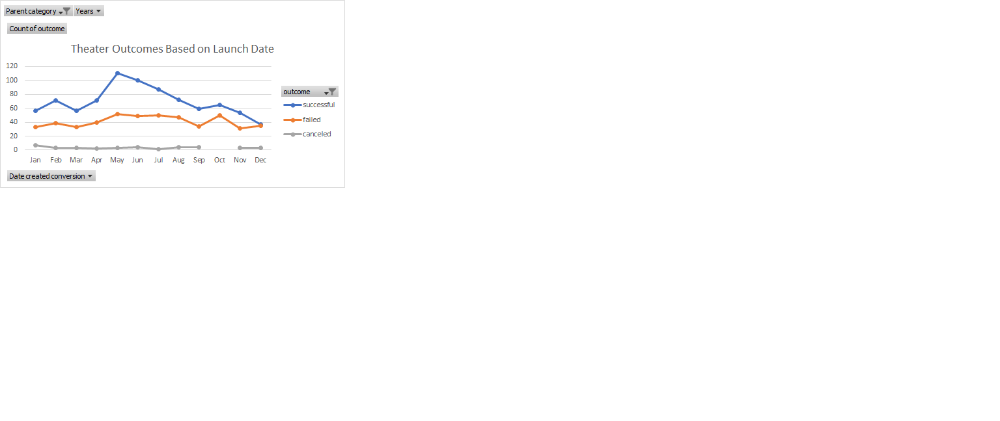
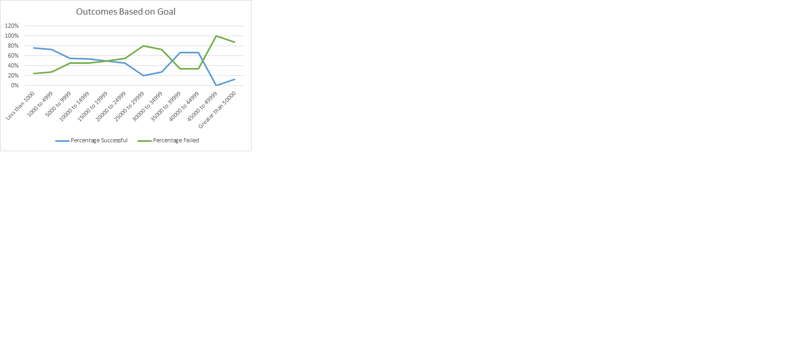

# Kickstarter-analysis
## Overview of project:
Kickstarter project involves playing Louise to analyze the data set for visualizing campaign outcomes based on launch date and their fundraising goals. 
### Purpose:
Purpose of this project is to utilize the excel and github skills learned in module 1 for analyzing outcomes based and launch date and outcomes based on goals, writing a report of the data analyzed for Louise’s Kickstarter campaign.
## Analysis and challenges:
### Analysis of outcomes based on launch date:
Plays were more successful in May-June and failed or less successful more in Nov-Dec. Hence after seeing the data, we can conclude that summer is the best time to have plays to be successful.

[https://github.com/JyotsnaMuppasani/Kickstarter-analysis/blob/52e66b36816c531dfda4b265583e1794877a611f/Resources/Theater_Outcomes_vs_Launch.png]
### Analysis of outcomes based on goals:
From the chart we can see that between 1000 to 19999 the percentage failed is less, if goals were set for $25,0000 the 100% success can be achieved. Also, the line is almost straight between 35000 to 39999 and 40000 to 44999. Goal between 1000 and 20000 are more successful and achievable based on chart. 

[https://github.com/JyotsnaMuppasani/Kickstarter-analysis/blob/52e66b36816c531dfda4b265583e1794877a611f/Resources/Outcomes_vs_Goals.png]
### Challenges or difficulties encountered.
1.	The data set contains 4114 campaigns to be analyzed. 
2.	Challenges encountered was to change the date format into MM/DD/YYYY (column S in Kickstarter sheet) since it was given in Unix timestamp (column S in Kickstarter sheet for which formula =(((J2/60)/60)/24)+DATE(1970,1,1) was used. Year was extracted from this column with formula YEAR(S2). 
3.	For getting average donation conditional formatting was used since error message had to be resolved because it was not divisible by 0. 
4.	Another challenge was to create a parent category and subcategory since category and subcategory was in same column in the given dataset. Text to columns was used to create the parent and subcategory.
5.	Pivot table was created for the project which included parent category and years to be filtered and count of outcomes including only months. For this launched at was used for rows in pivot chart, the years and quarters had to be removed so that we get only months in the rows.
6.	In the columns outcomes used have columns live, failed, canceled, successful etc which was later put in descending order to create table to analyze better and live was removed using the filter in column labels to see only the successful, failed and canceled.
7.	For creating line chart for Theater outcomes based on launch date, chart title was changed, in parent category only theater was selected.
8.	For analyzing outcomes based on goals new worksheet containing goals, no. successful, no. failed, no. canceled, total projects and percentage successful, percentage failed, and percentage canceled columns were created. Rows were created specifically in groups. 
9.	Countifs formula was used to get the data for all rows and columns. This needed viewing original Kickstarter worksheet and for this tables were created for goals, outcomes, and subcategory since we were using multiple worksheets. 
## Results: 
•	From the outcomes based on launch date chart we can conclude saying that
1.	Plays were more successful in May-June
2.	failed or less successful more in Nov-Dec. 

•	From the outcomes based on goals chart we can conclude saying goals can be set for 20000 for having more success.
### Limitations:
The drop in success from outcomes based on goals chart can be due to the correlation between months and countries or other factors which cannot be seen in the present chart. 
### Recommendations: 
Tables and charts can be created to see how each subcategory is achieving its fundraising goals successfully in various countries and which months are best for each subcategory. Therefore, another chart and table can be made to include countries to be included along with the columns already present in outcomes based on goals sheet for viewing percentage of success.

 

